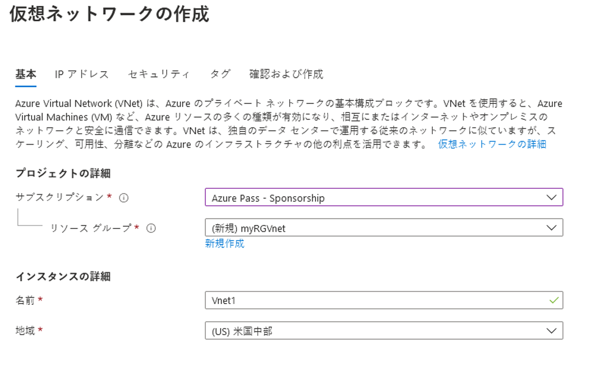
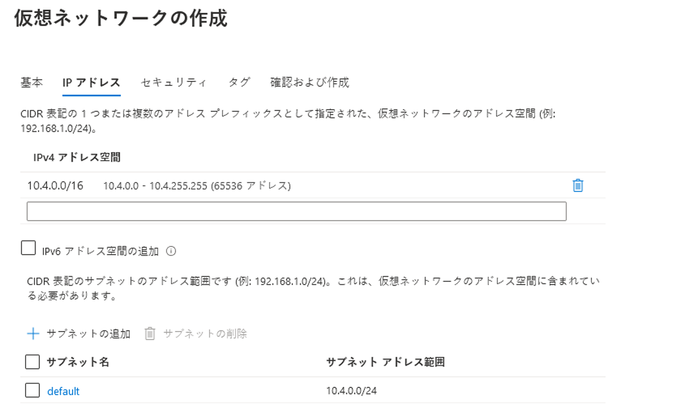

---
wts:
    title: '04 - 仮想ネットワークを作成する (20 分)'
    module: 'モジュール 02 - Azure のコア サービス (ワークロード)'
---
# 04 - 仮想ネットワークを作成する

このチュートリアルでは、仮想ネットワークを作成し、その仮想ネットワークに 2 台の仮想マシンをデプロイして、その仮想ネットワーク経由で一方の仮想マシンから他方の仮想マシンに ping を実行できるように構成します。

# タスク 1: 仮想ネットワークを作成する (20 分)

このタスクでは、仮想ネットワークを作成します。 

1. <a href="https://portal.azure.com" target="_blank"><span style="color: #0066cc;" color="#0066cc">https://portal.azure.com</span></a> で Azure portal にサインインします

2. **「すべてのサービス」** ブレードで、**「仮想ネットワーク」** を検索して選択し、**「+ 追加」** をクリックします 

3. **「仮想ネットワークの作成」** ブレードで、以下をを入力します (その他の情報は既定値のままにします)。

    | 設定 | 値 | 
    | --- | --- |
    | 名前 | **vnet1** |
    | アドレス空間 |**10.1.0.0/16** |
    | サブスクリプション | **サブスクリプションを選択します** |
    | リソース グループ | **myRGVNet** (新規作成) |
    | 場所 | **(米国) 米国東部** |
    | サブネット - 名前 | **default** |
    | サブネットのアドレス範囲 | **10.1.0.0/24** |

    
    

5. **「確認および作成」** ボタンをクリックします。検証に合格していることを確認します。

6. **「作成」** ボタンをクリックして、仮想ネットワークをデプロイします。 

    **注**: 組織にとって、必要な仮想ネットワークと IP アドレスを知るにはどうすればよいでしょうか。

# タスク 2: 2 つの仮想マシンを作成する

このタスクでは、仮想ネットワークに 2 つの仮想マシンを作成します。 

1. **「すべてのサービス」** ブレードで、**「仮想マシン」** を検索し、**「+ 追加」** をクリックします 

2. **「基本」** タブで、次の情報を入力します (その他の情報は既定値のままにします)。

   | 設定 | 値 | 
   | --- | --- |
   | サブスクリプション | **サブスクリプションを選択する**  |
   | リソース グループ |  **myRGVNet** |
   | 仮想マシン名 | **vm1**|
   | リージョン | **(米国) 米国東部** |
   | 画像 | **Windows Server 2019 Datacenter** |
   | ユーザー名| **azureuser** |
   | パスワード| **Pa$$w0rd1234** |
   | パブリック受信ポート| **「選択したポートを許可する」** を選択します  |
   | 選択した受信ポート| **RDP (3389)** |
   |||

3. **「ネットワーク」** タブを選択します。仮想マシンが vnet1 仮想ネットワークに配置されていることを確認します。既定の設定を確認しますが、他の変更は行わないでください。 

   | 設定 | 値 | 
   | --- | --- |
   | 仮想ネットワーク | **vnet1** |
   |||

4. **「確認および作成」** をクリックします。検証に成功したら、**「作成」** をクリックしますデプロイの時間はさまざまに異なる可能性がありますが、通常デプロイには 3 分から 6 分かかる可能性があります。

5. デプロイを監視しますが、次の手順に進みます。 

6. 上記の手順 **2〜4** を繰り返して、2 番目の仮想マシンを作成します。別の仮想マシン名を使用し、その仮想マシンが新しい仮想ネットワークにあり、新しいパブリック IP アドレスを使用していることを確認してください。

    | 設定 | 値 |
    | --- | --- |
    | リソース グループ | **myRGVNet** |
    | 仮想マシン名 |  **vm2** |
    | 仮想ネットワーク | **vnet1** |
    | パブリック IP | (新しい) **vm2-ip** |
    |||

7. 両方の仮想マシンがデプロイされるのを待ちます。 

# タスク 3: 接続をテストする 

このタスクでは、ICMP 接続を許可し、仮想マシンが相互に通信 (ping) できることをテストします。 

1. **「すべてのリソース」** ブレードで、**vm1** を検索して、その **「概要」** ブレードを開き、その **「状態」** が **「実行中」** であることを確認します。ページを**更新**する必要がある場合があります。

2. **「概要」** ブレードで、**「接続」** ボタンをクリックします。

    **注**: 次の指示では、Windows コンピューターから VM に接続する方法を説明しています。 

3. **「仮想マシンに接続」** ブレードで、ポート 3389 経由で IP アドレスで接続する既定のオプションを保持し、**「RDP ファイルのダウンロード」** をクリックします。

4. ダウンロードした RDP ファイルを開き、指示されたら **「接続」** をクリックします。 

5. **「Windows セキュリティ」** ウィンドウで、ユーザー名「**azureuser**」とパスワード「**Pa$$w0rd1234**」を入力し、**「OK」** をクリックします。

6. サインイン プロセス中に証明書の警告が表示されることがあります。**「はい」** をクリックするか、接続を作成してデプロイした VM に接続します。正常に接続されるはずです。

7. 仮想マシンで PowerShell コマンド プロンプトを開くには、**「スタート」** ボタンをクリックし、**「PowerShell」** と入力し、「**Windows PowerShell**」 を右クリックして、右クリック メニューで、 **「管理者として実行」** をクリックします。

8. vm2 に対して ping を実行します (vm2 が実行されていることを確認します)。要求がタイムアウトしたというエラーが表示されます。  `ping` では**インターネット制御メッセージ プロトコル (ICMP)** が使用されるため、`ping` は失敗します。既定では、Windows ファイアウォールを介した ICMP は許可されていません。


   ```PowerShell
   ping vm2
   ```
   
   

    **注**: ここで、vm2 への RDP セッションを開き、着信 ICMP 接続を許可します。

9. RDP を使用して **vm2** に接続します。手順 **2 ～ 6** を使って実行してください。

10. **PowerShell** プロンプトを開き、ICMP を許可します。このコマンドを使用すると、Windows ファイアウォール経由の ICMP の受信接続が許可されます。

   ```PowerShell
   New-NetFirewallRule –DisplayName “Allow ICMPv4-In” –Protocol ICMPv4
   ```
   

   **注**: RDP セッションを vm1 に切り替えて、ping を再試行します

11. RDP セッションを vm1 に戻して、ping を再試行します。これで成功するはずです。 

   ```PowerShell
   ping vm2
   ```

お疲れさまでした! 仮想ネットワークで 2 つの仮想マシンを構成してデプロイしました。また、仮想マシンの 1 つが着信 ping 要求を許可するように Windows ファイアウォールを構成しました。 

**注**: 追加コストを回避するには、このリソース グループを削除します。リソース グループを検索し、リソース グループをクリックして、**「リソース グループの削除」** をクリックします。リソース グループの名前を確認し、**「削除」** をクリックします。**通知**を監視して、削除の進行状況を確認します。
