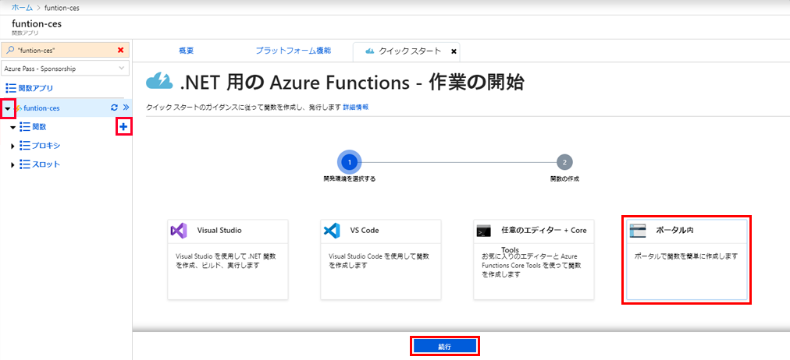
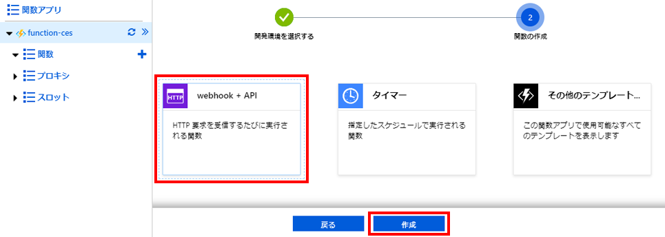
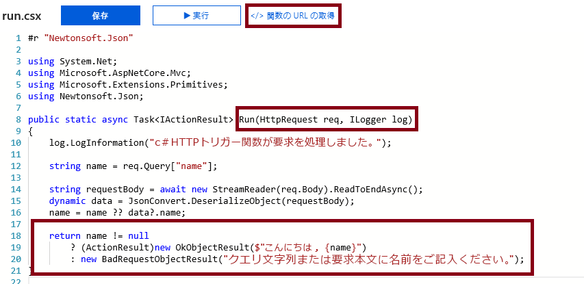
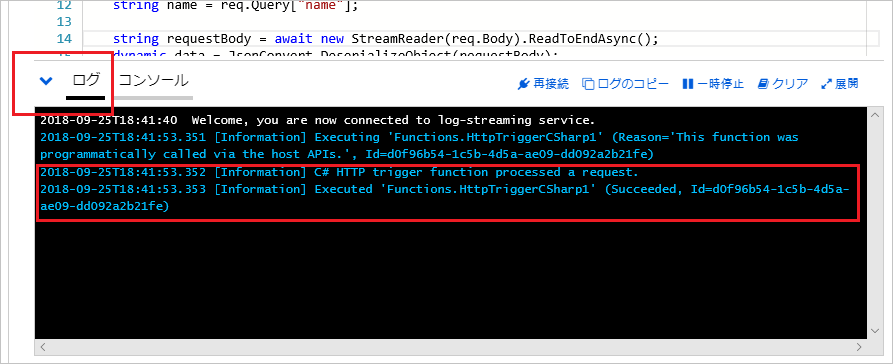

---
wts:
    title: '07 - Azure Functions の実装'
    module: 'モジュール 02 - コア Azure サービス'
---
# 07 - Azure Functions の実装

このチュートリアルでは、HTTP 要求がある場合に Hello メッセージを表示する関数アプリを作成します。 

推定時間: 30 分

# タスク 1: 関数アプリを作成する

このタスクでは、Function アプリを作成します。

1. [Azure Portal](https://portal.azure.com) にサインインします。

2. **Function App** を検索して、「**追加**」 をクリックします。

3. Azure Function App の設定フィールドに入力します。指定しない場合は、デフォルトを使用します。 

    | 設定 | 値 |
    | -- | --|
    | アプリ名 | **function-xxx** (一意である必要があります) |
    | サブスクリプション | **サブスクリプションを選択する** |
    | リソース グループ | **myRGFunction** (新規作成) |
    | OS | **Windows** |
    | ホスティング プラン | **消費計画** |
    | 場所 | **米国東部** |
    | | |	

4. 「**作成**」 ボタンを選択して、新しい Azure Function App のプロビジョニングとデプロイを開始します。

5. リソースが作成されたという通知を待ちます。

6. Function App ページを **更新** し、新しいリソースが *実行されている* ことを確認します。 

    

# タスク 2: HTTP トリガー関数とテストを作成します。

このタスクでは、Webhook + API 関数を使用して、HTTP 要求がある場合にメッセージを表示します。 

1. 新しい関数アプリを選択します。

2. 「**関数**」 の横にある 「**+**」 ボタンを選択し、「**ポータル内**」 を選択します。Visual Studio および VS コードで開発するためのその他の選択肢に注目してください。「**続行**」 をクリックします。 

    

3. 「**WebHook + API**」、「**作成**」 の順に選択します。これにより、アプリが HTTP 要求を受信するたびに関数が実行されます。他にも多数のテンプレートから選択できます。

    

4. このコードは、HTTP 要求を実行して情報を記録するように設計されています。また、関数が名前付きの Hello メッセージを返します。 

    

5. 関数エディターの上部から 「**関数 URL の取得**」 を選択します。 

6. 「**キー**」 ドロップダウン値を **既定値 (ファンクション キー)** に設定します。次に、「**コピー**」 を選択して関数の URL をコピーします。 

    

7. コピーした関数 URL を Web ブラウザーのアドレス バーに貼り付けます。ページが要求されると、関数が実行されます。関数に名前が必要であるというメッセージが表示されます。 

    

8. URL の末尾に **&name=yourname** を追加します。 

    **注記**: ここでは、`<yourname>` にユーザーの名前を入力します。最終的なURLは、`https://azfuncxxx.azurewebsites.net/api/HttpTrigger1?code=X9xx9999xXXXXX9x9xxxXX==&name=cindy` のようになります

    

9. 関数が実行されると、Azure のログ ファイルにトレース情報が書き込まれます。Azure Portal でログを表示するには、関数エディターに戻り、「**ログ**」 ボタンを選択します。

    

お疲れさまでした。このチュートリアルでは、HTTP 要求がある場合に Hello メッセージを表示する関数アプリを作成しました。 

**注記**: 追加コストを回避するには、このリソース グループを削除します。リソース グループを検索し、リソース グループをクリックして、「**リソース グループの削除**」 をクリックします。リソース グループの名前を確認し、「**削除**」 をクリックします。**通知** を監視して、削除の進行状況を確認します。