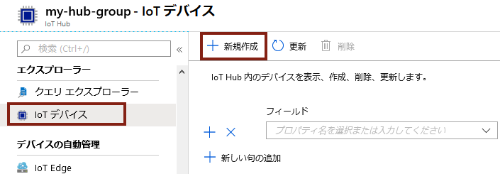
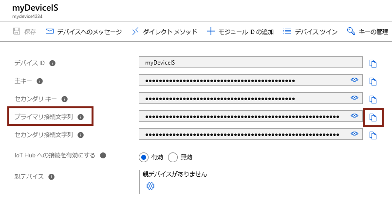
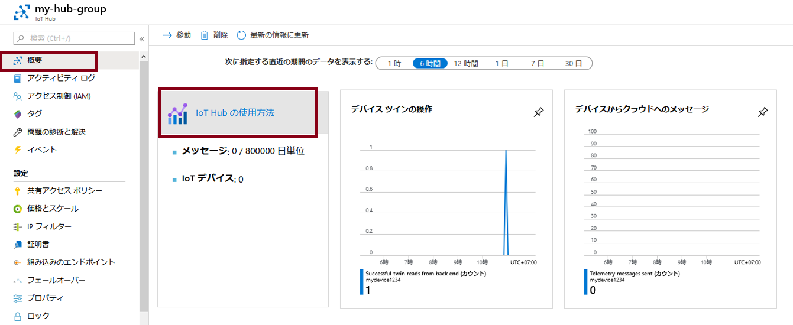

---
wts:
    title: '07 - Azure IoT Hub の実装 (10 分)'
    module: 'モジュール 03: コア ソリューションおよび管理ツールに関する説明'
---
# 07 - Azure IoT Hub の実装

このチュートリアルでは、Azure portal で新しい Azure IoT Hub をセットアップし、オンライン Raspberry Pi デバイス シミュレーターを使用して IoT デバイスへの接続を認証するようにします。センサー データとメッセージが Raspberry Pi シミュレーターから Azure IoT Hub に渡されるので、Azure portal でメッセージング アクティビティのメトリックを表示します。

# タスク 1: IoT Hub を作成する (10 分)

このタスクでは、IoT ハブを作成します。 

1. [Azure Portal](https://portal.azure.com) にサインインします。

2. **IoT Hub** を検索して選択し、「**+追加**」 をクリックします。

3. フィールドに次の詳細を入力します。

    | 設定 | 値 |
    |--|--|
    | サブスクリプション | **サブスクリプションを選択する** |
    | リソース グループ |  **myRGIoT** (新規作成)|
    | リージョン | **米国東部** |
    | IoT Hub 名 | **my-hub-group** |
    | | |

    **注意** - **xxxx** を変更し、独自の **IoT ハブ名** を設定しください

4. **管理** タブに移動し、**Pricing and scale tier** (価格とスケール レベル) で、ドロップダウン リストから **S1: Standard レベル** を選択します。

5. 「**確認および作成**」 ボタンをクリックします。 

6. 「**作成**」 ボタンをクリックして、新しい Azure IoT Hub の作成を開始します。 

7. リソースがデプロイされるまで待ちます。 

# タスク 2: IoT デバイスを追加する

このタスクでは、IoT デバイスを IoT ハブに追加します。 

1. デプロイが完了したら、「**通知**」 ページから 「**リソースに移動**」 を選択します。    または、**IoT Hub** を検索して新しいリソースを見つけることができます。 

	

2. 新しい IoT デバイスを追加するには、「**IoT Hub ナビゲーション**」 ブレードから 「**エクスプローラー**」 > 「**IoT デバイス**」 を選択 します。次に、「**新規**」 ボタンを選択します。

	

3. 新しい IoT デバイスの名前 **myRaspberryPi** を入力し、「**保存**」 ボタンをクリックします。これにより、Azure IoT Hub に新しい IoT デバイス ID が作成されます。

4. 新しいデバイスが表示されない場合は、「IoT デバイス」 ページを **更新** します。 

5. **myRaspberryPi** を選択し、 **プライマリ接続文字列** 値をコピーします。次のタスクでこのキーを使用して、Raspberry Pi シミュレーターへの接続を認証します。

	

# タスク 3: Raspberry Pi シミュレーターを使用してデバイスをテストする

このタスクでは、Raspberry Pi シミュレーターを使用してデバイスをテストします。 

1. Web ブラウザーで、[Raspberry Pi オンライン シミュレーター](https://azure-samples.github.io/raspberry-pi-web-simulator/#Getstarted) を開きます。 

2. Raspberry Pi シミュレーターについて読んでください。概要ポップアップがある場合は、「**X**」 を選択してウィンドウを閉じます。

3. コーディング領域の右側で、'const connectionString =' の行を見つけます。DeviceId を変更し、プライマリ接続スティングを使用します。

	

4. 「**実行**」 (下部ウィンドウ) を選択してアプリケーションを実行します。  コンソール出力に、Raspberry Pi シミュレーターから Azure IoT Hub に送信されるセンサー データとメッセージが表示されるはずです。データとメッセージは、Raspberry Pi シミュレーター LEDが点滅するたびに送信されます。 

	

5. 「**停止**」 を選択してデータの送信を停止します。

6. Azure Portal と IoT ハブに戻ります。

7. IoT Hub の 「**概要**」 ブレードを選択し、**IoT Hub の使用状況** 情報まで下にスクロールします。 

	

お疲れさまでした。IoT デバイスからセンサー データを収集するように Azure IoT Hub をセットアップしました。

**注記**: 追加コストを回避するには、このリソース グループを削除します。リソース グループを検索し、リソース グループをクリックして、「**リソース グループの削除**」 をクリックします。リソース グループの名前を確認し、「**削除**」 をクリックします。**通知** を監視して、削除の進行状況を確認します。
