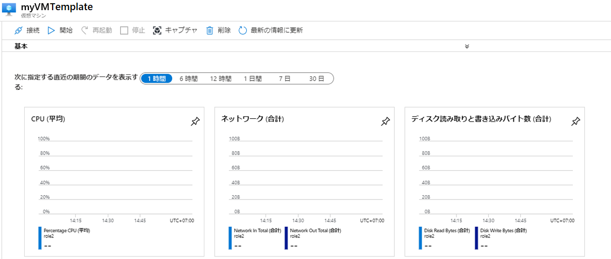

---
wts:
    title: '09 - テンプレートを使用した VM の作成'
    module: 'モジュール 02 - コア Azure サービス'
---
# 09 - テンプレートを使用した VM の作成

このチュートリアルでは、QuickStartテンプレートを使用して仮想マシンをデプロイし、監視機能を調べます。

推定時間: 30 分

# タスク 1: ギャラリーを探索し、テンプレートを見つける

このタスクでは、Azure QuickStart ギャラリーを参照し、テンプレートをデプロイして仮想マシンを作成します。 

1. ブラウザーで、 [Azure QuickStart テンプレート ギャラリー](https://azure.microsoft.com/resources/templates?azure-portal=true) にアクセスします。  ギャラリーには、人気のあるテンプレートや最近更新されたテンプレートが多数あります。これらのテンプレートは、Azure リソースと一般的なソフトウェア パッケージの両方で動作します。

2. 使用可能なさまざまな種類のテンプレートを参照します。興味のあるテンプレートはありますか。

3. [[シンプルな Windows VM をデプロイする](https://azure.microsoft.com/resources/templates/101-vm-simple-windows?azure-portal=true) テンプレートを検索するか、直接アクセスします。 

    **注記**: [**Azure にデプロイ**] ボタンを使用すると、テンプレートを Azure Portal に直接デプロイできます。このテンプレートでは、構成パラメーターの小さなセットの入力を求めるプロンプトのみが表示されます。 

4. [**Azure にデプロイ**] ボタンをクリックします。  

5. [**テンプレートの編集**] をクリックします。  Resource Manager テンプレート形式は JSON です。パラメーターを調べ、仮想マシン名を見つけます。名前を **myVMTemplate** に変更します。  変更を **保存** します。

    

6. テンプレートパラメータを設定します。 

	| 設定| 値|
	|----|----|
	| サブスクリプション | **サブスクリプションを選択する**|
	| リソース グループ | **myRGTemplate** (新規作成) |
    	| 管理者ユーザー名 | **azureuser** |
    	| 管理者パスワード | **Pa$$w0rd1234** |
    	| DNS ラベルのプレフィックス | **Myvmtemplatexxx** (一意である必要があります) |
    	| Windows OS バージョン | **2016 - データセンター** |
   	| | |

7. **上記の使用条件に同意する** チェックボックスをオンにし、[**購入**] をクリックします。

    **注記**: このテンプレートに関連する費用はありません。

8. デプロイを監視します。 

# タスク 2: 仮想マシンのデプロイを確認および監視する

このタスクでは、正しくデプロイされた仮想マシンを確認します。 

1. [**仮想マシン**] を検索して選択 します。

2. 新しい仮想マシンが作成されたことを確認します。 

    

3. 仮想マシンを選択し、[**概要**] ウィンドウを下にスクロールして監視データを表示します。

4. 時間枠は 1 時間から 30 日に調整可能です。

5. **CPU (平均)**、**ネットワーク (合計)**、 および **ディスク バイト (合計)** を含むさまざまなグラフィックスが提供されます。 

    

6. 任意のグラフィックをクリックします。**メトリックを追加** し、グラフの種類を変更します。時間があれば、実験を行いましょう。 

7. [**概要**] ブレードに戻ります。

8. **アクティビティ ログ** (左側のウィンドウ) をクリックします。アクティビティ ログは、リソースの作成時または変更時に記録され、 

9. [**フィルタの追加**] をクリックし、さまざまなイベントの種類と操作の検索を試行します。 

    ![[イベントの種類] が選択された [フィルターの追加] ページのスクリーンショット。](../images/0904.png)

**注記**: 追加コストを回避するには、このリソース グループを削除します。リソース グループを検索し、リソース グループをクリックして、[**リソース グループの削除**] をクリックします。リソース グループの名前を確認し、[**削除**] をクリックします。**通知** を監視して、削除の進行状況を確認します。