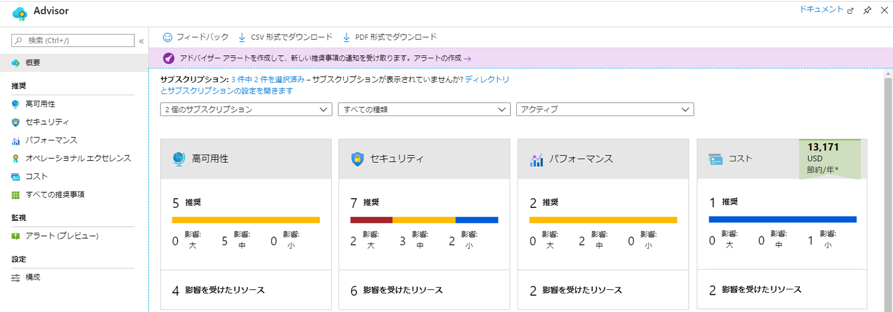

---
wts:
    title: '10 - PowerShell を使用して VM を作成する (10 分)'
    module: 'モジュール 03: コア ソリューションおよび管理ツールに関する説明'
---
# 10 - PowerShell を使用して VM を作成する

このチュートリアルでは、Cloud Shell を構成し、Azure PowerShell モジュールを使用してリソース グループと仮想マシンを作成し、Azure Advisor の推奨事項を確認します。 

# タスク 1: Cloud Shell を設定する (10 分)

このタスクでは、Cloud Shell を構成します。 

1. [Azure portal](https://portal.azure.com) にサインインします。

2. Azure portal から、Azure portal の右上にあるアイコンをクリックして、**Azure Cloud Shell** を開きます。

    

3. 以前に Cloud Shell を使用したことがある場合は、次のタスクに進みます。 

4. **Bash** や **PowerShell** のどちらかを選択するためのプロンプトが表示されたら、**PowerShell** を選択します。

5. プロンプトが表示されたら、**ストレージを作成**し、Azure Cloud Shell が初期化されるまで待機します。 

# タスク 2: リソース グループと仮想マシンを作成する

このタスクでは、PowerShell を使用して、リソース グループと仮想マシンを作成します。  

1. Cloud Shell ペインの左上のドロップダウン メニューで、**「PowerShell」** が選択されていることを確認します。

2. PowerShell セッションで、Cloud Shell ウィンドウ内に新しいリソース グループを作成します。 

    ```PowerShell
    New-AzResourceGroup -Name myRGPS -Location EastUS
    ```

3. 新しいリソース グループを確認します。 

    ```PowerShell
    Get-AzResourceGroup | Format-Table
    ```

4. 仮想マシンを作成します。プロンプトが表示されたら、その仮想マシンのローカル管理者アカウントとして構成されるユーザー名 (**azureuser**) とパスワード (**Pa$$w0rd1234**) を入力します。最後の行を除いて、各行の最後にティック (`) 文字を含めるようにしてください (1 行にコマンド全体を入力する場合はティック文字を含めないでください)。

    ```PowerShell
    New-AzVm `
    -ResourceGroupName "myRGPS" `
    -Name "myVMPS" `
    -Location "East US" `
    -VirtualNetworkName "myVnetPS" `
    -SubnetName "mySubnetPS" `
    -SecurityGroupName "myNSGPS" `
    -PublicIpAddressName "myPublicIpPS"
    ```
** VM がデプロイされるのを待ってから PowerShell を閉じる

5. PowerShell セッションの 「Cloud Shell」 ウィンドウを閉じます。

6. Azure portal で、**仮想マシン**を検索し、**myVMPS** が実行されていることを確認します。これには数分かかることがあります。

    

7. 新しい仮想マシンにアクセスし、「概要」 と 「ネットワーク」 の設定を確認して、情報が正しくデプロイされたことを確認します。 

# タスク 3: Cloud Shell でコマンドを実行する

このタスクでは、Cloud Shell から PowerShell コマンドを実行する練習を行います。 

1. Azure portal から、Azure portal の右上にあるアイコンをクリックして、**Azure Cloud Shell** を開きます。

2. Cloud Shell ペインの左上のドロップダウン メニューで、**「PowerShell」** が選択されていることを確認します。

3. 名前、リソース グループ、場所、状態など、仮想マシンに関する情報を取得します。PowerState が**実行されている**ことに注目してください。

    ```PowerShell
    Get-AzVM -name myVMPS -status | Format-Table -autosize
    ```

4. 仮想マシンを停止します。プロンプトが表示されたら、アクションを確認 (はい) します。 

    ```PowerShell
    Stop-AzVM -ResourceGroupName myRGPS -Name myVMPS
    ```

5. 仮想マシンの状態を確認します。これで、PowerState の **割り当てが解除されます**。ポータルで仮想マシンの状態を確認することもできます。 

    ```PowerShell
    Get-AzVM -name myVMPS -status | Format-Table -autosize
    ```

# タスク 4: Azure Advisor の推奨事項を確認する

**注記:** この同じタスクは、「Azure CLI ラボを使用した VM の作成」にあります。 

このタスクでは、仮想マシンの Azure Advisor の推奨事項を確認します。 

1. **「すべてのサービス」** ブレードから、**「アドバイザー」** を検索して選択します。 

2. **「アドバイザー」** ブレードで、**「概要」** を選択します。通知の推奨事項は、高可用性、セキュリティ、パフォーマンス、コストごとにグループ化されています。 

    

3. **「すべての推奨事項」** を選択し、各推奨事項と推奨されるアクションを表示します。 

    **注記:** リソースに応じて、推奨事項が異なります。 

    

4. 推奨事項を CSV または PDF ファイルとしてダウンロードできることに注意してください。 

5. アラートを作成できることに注意してください。 

6. 時間があれば、Azure PowerShell の実験を続けてください。 

お疲れさまでした! Cloud Shell を構成し、PowerShell を使用して仮想マシンを作成し、PowerShell コマンドで練習し、Advisor の推奨事項を表示しました。

**注**: 追加コストを回避するには、このリソース グループを削除します。リソース グループを検索し、リソース グループをクリックして、**「リソース グループの削除」** をクリックします。リソース グループの名前を確認し、**「削除」** をクリックします。**通知**を監視して、削除の進行状況を確認します。
