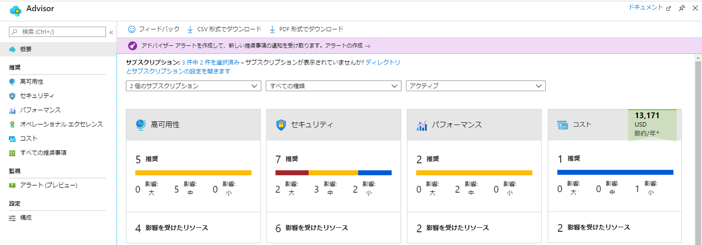

---
wts:
    title: '11 - CLIを使用してVMを作成する'
    module: 'モジュール 02 - コア Azure サービス'
---
# 11 - CLI を使用して VM を作成する

このチュートリアルでは、Azure CLI をローカルにインストールし、リソース グループと仮想マシンを作成し、Cloud Shell を使用し、Azure Advisor の推奨事項を確認します。 

推定時間: 35 分

**注記**: 次の手順は Windows のインストール環境に基づいていますが、Mac 環境や Linux 環境にも対応しています。ただし、[環境ごとに特定のインストール手順があります。](https://docs.microsoft.com/cli/azure/install-azure-cli)

# タスク 1: CLI をローカルにインストールする

このタスクでは、ローカル コンピュータに Azure CLI をインストールします。 

1. [Azure CLI msi](https://aka.ms/installazurecliwindows) をダウンロードし、ブラウザーで [**実行**] を選択します。ファイルがダウンロードされるには 1 分かかります。

2. Microsoft Azure CLI セットアップ ウィザードで、[**使用許諾契約に同意する**] ボックスをクリックして、[**インストール**] をクリックします 。

3. [**ユーザーアカウント制御**] ダイアログで [**はい**] を選択して、アプリがデバイスを変更できることを示します。 

4. インストールが完了したら、[**完了**] を選択します。

    **注記:** Azure CLI は Linux または Mac OS 用の Bash シェルを開くか、Windows 用のコマンド プロンプトまたは PowerShell アプリから実行されます。 

# タスク 2: リソースグループと仮想マシンを作成する

1. ローカル コンピュータで、**コマンド プロンプト** を開きます。必ず **管理者として実行** してください。プロンプトが表示されたら、アプリがデバイスに変更を加えることができることを確認します (はい)。

    **注記**: Windows コマンド プロンプトからではなく、PowerShell セッションから Azure CLI を実行することが可能です。PowerShell から CLI を実行すると、タブ補完機能が増えるなどの利点があります。

2. Azure サブスクリプションにログインします。サブスクリプションに関連付けられているアカウントを選択し、正常にログインするまで待ちます。 

```azurecli
az login
```

3. 必要に応じて、[Azure CLI ドキュメント](https://docs.microsoft.com/ja-jp/cli/azure/?view=azure-cli-latest) ページをブックマークします。

4. バージョン チェック コマンドを実行してインストールを確認し、正常に実行されていることを確認します。最新の更新を確認できないという警告メッセージは問題ありません。 

```cli
az --version
```

5. 新しいリソース グループを作成します。

```cli
az group create --name myRGCLI --location EastUS
```

6. リソース グループが作成されたことを確認します。

```cli
az group list --output table
```

7. 新しい仮想マシンを作成します。このコマンドはすべて 1 行にする必要があります。また、すべてが1行にある場合は、目盛り (`) マークを使用しないでください。 


```cli
    az vm create `
        --name myVMCLI `
        --resource-group myRGCLI `
        --image UbuntuLTS `
        --location EastUS `
        --admin-username azureuser `
        --admin-password Pa$$w0rd1234
```

    **注記**: コマンドの完了には 2 ~ 3 分かかります。このコマンドは、仮想マシンと、それに関連するストレージ、ネットワーク、セキュリティ リソースなどのさまざまなリソースを作成します。仮想マシンのデプロイが完了するまで、次の手順に進まないでください。Azure Cloud Shell が完了したら閉じられます。


8. コマンドの実行が完了したら、[Azure Portal](https://portal.azure.com) にサインインします。

9. **仮想マシン** を検索し、**myVMCLI** が実行されていることを確認します。

    

10. ローカル CLI セッションを閉じます。 

# タスク 3: Cloud Shell でコマンドを実行する

このタスクでは、Cloud Shell から CLI コマンドを実行する練習を行います。 

1. ポータルから、Azure Portal の右上にある *Azure Cloud Shell のアイコン* をクリックして、 **Azure Cloud Shell** を開きます。

    

2. 以前に Cloud Shell を使用したことがある場合は、手順 5 に進みます。 

3. **Bash** や **PowerShell** のどちらかを選択するためのプロンプトが表示されたら、**Bash** を選択します。 

4. プロンプトが表示されたら、**ストレージを作成** し、Azure Cloud Shell の初期化を許可します。 

5. 左上のドロップダウンメニューで **Bash** が選択されていることを確認します。

**シェルを使用する場合はログインする必要はありません。**

6. 名前、リソース グループ、場所、状態など、仮想マシンに関する情報を取得します。PowerState が **実行されている** ことに注目してください。

```cli
az vm show --resource-group myRGCLI --name myVMCLI --show-details --output table 
```

7. 仮想マシンを停止します。仮想マシンの割り当てが解除されるまで請求が続行されることを示すメッセージに注意してください。 

```cli
az vm stop --resource-group myRGCLI --name myVMCLI
```

8. 仮想マシンの状態を確認します。これで、PowerState が **停止されます**。

```cli
az vm show --resource-group myRGCLI --name myVMCLI --show-details --output table 
```

# タスク 4: Azure Advisor の推奨事項を確認する

このタスクでは、Azure Advisor の推奨事項を確認します。 

    **注記:** 前のラボ（PowerShellでVMを作成する）を実行した場合、このタスクは既に完了しています。 

1. ポータルから、**Advisor** を検索して選択します。 

2. [アドバイザー] で、[**概要**] を選択します。通知の推奨事項は、高可用性、セキュリティ、パフォーマンス、コストごとにグループ化されています。 

    

3. [**すべての推奨事項**] を選択し、各推奨事項と推奨されるアクションを表示します。 

    **注記:** リソースに応じて、推奨事項が異なります。 

    ![[アドバイザーすべての推奨事項] ページのスクリーンショット。 ](../images/1104.png)

4. 推奨事項を CSV または PDF ファイルとしてダウンロードできることに注意してください。 

5. アラートを作成できることに注意してください。 

6. 時間があるので、Azure CLI の実験を続けてください。

お疲れさまでした。PowerShell をローカル コンピュータにインストールし、PowerShell を使用して仮想マシンを作成し、PowerShell コマンドで練習し、Advisor の推奨事項を表示しました。

**注記**: 追加コストを回避するには、このリソース グループを削除します。リソース グループを検索し、リソース グループをクリックして、[**リソース グループの削除**] をクリックします。リソース グループの名前を確認し、[**削除**] をクリックします。**通知** を監視して、削除の進行状況を確認します。

