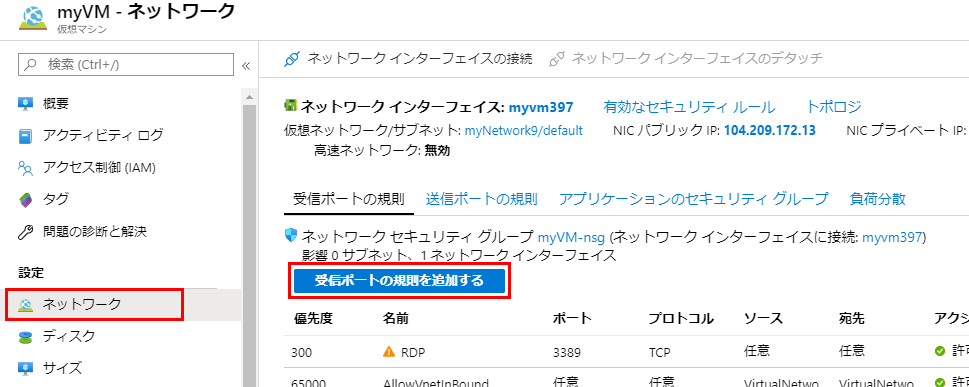

---
wts:
    title: '12 - セキュリティ保護されたネットワーク トラフィック'
    module: 'モジュール 03 - セキュリティ、プライバシー、コンプライアンス、および信頼性'
---
# 12 - セキュリティ保護されたネットワーク トラフィック

このチュートリアルでは、インバウンドおよびアウトバウンドのセキュリティ ポート ルールを作成および構成します。

推定時間: 45 分

# タスク 1: 仮想マシンを作成する

このタスクでは、仮想マシンを作成するカスタム テンプレートをデプロイします。 

1. [Azure Portal](https://portal.azure.com) にサインインします。

2. [**カスタム テンプレートをデプロイする**] を検索して選択します。

3. [**Windows ｖの作成**] を選択します。

4. テンプレートを完成します。

    | 設定 | 値 |
    | -- | -- |
    | サブスクリプション | **サブスクリプションを選択する** |
    | リソース グループ | **myRGSecure** (新規作成) |
    | 場所 | **(US) 米国東部** |
    | 管理者ユーザー名 | **azureuser** |
    | 管理者パスワード | **Pa$$w0rd1234** |
    | DNS プレフィックス | **myrgsecurexxx**(一意である必要があります) |
    | Windows OS バージョン | 2016 - データセンター |
    | | |

5. **上記の利用規約に同意する** には、チェックボックスをオンにします。 

6. [**購入**] をクリックします。  

7. デプロイを監視します。リソース グループと仮想マシンが作成されるまでに数分かかる場合があります。 

8. [**通知**] ウィンドウから [**リソースに移動**] を選択します。 

9. **SimpleWinVM** 仮想マシンを選択します。

10. [**ネットワーク**] をクリックし、「このネットワークインターフェイスにはネットワークセキュリティグループが含まれていません」というメッセージが表示されます。

11. また、ネットワークインターフェイスの名前 **myVMNic** にも注意してください。

# タスク 2: ネットワーク セキュリティ グループを作成する

このタスクでは、ネットワーク セキュリティ グループを作成し、ネットワーク インターフェイスを関連付けます。

1. ポータルで、[**ネットワーク セキュリティ グループ**] を検索して選択します。 

2. [**+ 追加**] をクリックし、フォームに入力します。 

    | 設定 | 値 |
    | -- | -- |
    | サブスクリプション | **サブスクリプションを選択する** |
    | リージョン | **(US) 米国東部**  |
    | リソース グループ | **myRGSecure** (リージョンが設定されるまで使用できません) |
    | 名前 | **myNSGSecure** |
    | | |

3. [**確認および作成**] をクリックし、検証後に [**作成**] をクリックします。

4. NSG が作成されたら、**リソースに移動** します。

5. [**設定**] の [**ネットワーク インターフェイス**] をクリックし、**関連付け** ます。

6. ネットワークが新しい仮想マシンに干渉する **myVMNic** を選択します。 

# タスク 3: RDP を許可する受信セキュリティ ポートの規則を構成する

このタスクでは、受信セキュリティ ポートの規則を構成して、仮想マシンに RDP を許可します。 

1. 新しい仮想マシンを見つけます。 

3. [**概要**] ウィンドウで、[**接続**] をクリックします。

4. RDP を使用して仮想マシンへの接続を試みます。既定では、ネットワーク セキュリティ グループは RDP を許可しません。エラー ウィンドウを閉じます。 

    

5. [**設定**]で、[**ネットワーク**] をクリックし、[**受信ポートルールの追加**] をクリックします。ルールは、ロード バランサーを含む仮想ネットワーク内のトラフィックを除くすべての受信トラフィックを拒否します。

    

6. 受信セキュリティ ポートの規則を確認します。許可され、ポート 3389 を介した RDP がリストされていないことを確認します。 

7. [**受信ポートの規則の追加**] をクリックします。  完了したら、[**追加**] をクリックします。 

    | 設定 | 値 |
    | -- | -- |
    | ソース | **任意**|
    | 送信元ポートの範囲 | * |
    | 宛先 | **任意** |
    | 宛先ポート範囲 | **3389** |
    | プロトコル | **TCP** |
    | アクション | **許可** |
    | 優先度 | **300** |
    | 名前 | **RDP を許可する** |
    | | |

8. ルールが展開されるのを待ってから、RDP を仮想マシンに再度実行します。今回は成功するはずです。ユーザーが **azureuser** であり、パスワードが **Pa$$w0rd1234** であることを覚えておきましょう。

# タスク 4: インターネット アクセスを拒否するように送信セキュリティ ポートの規則を構成する

このタスクでは、NSG を作成し、仮想マシンに関連付けます。次に、インターネットアクセスを拒否し、ルールが機能していることを確認するためにテストします。

**注記:** 最初のタスクでは、個々の仮想マシンにルールを適用しました。このタスクでは、多くのリソースにルールを適用できる NSG を使用しています。 

1. 仮想マシン RDP セッションを続行します。 

2. コンピュータが起動したら、**Internet Explorer** ブラウザを開きます。 

3. www.bing.com にアクセスできることを確認します。IE の強化されたセキュリティ ポップアップを操作する必要があります。 

**注記:** 次に、送信インターネット アクセスを拒否するルールを構成します。 

4. ポータルに戻り、仮想マシンを見つけます。

5. [**設定**] で、[**ネットワーク**] をクリックし、[**送信ポートの規則**] をクリックします。

6. [**インターネットへの送信を許可する**] というルールがあることに注意してください。これは既定のルールであり、削除できません。 

7. [**送信セキュリティ規則の追加**] をクリックし、インターネット トラフィックを拒否する優先順位の高い新しい送信セキュリティ規則を構成します。完了したら、[**追加**] をクリックします。 

    | 設定 | 値 |
    | -- | -- |
    | ソース | **任意**|
    | 送信元ポートの範囲 | * |
    | 宛先 | **サービス タグ** |
    | 宛先サービス タグ | **インターネット** |
    | 宛先ポート範囲 | * |
    | プロトコル | **TCP** |
    | アクション | **拒否** |
    | 優先度 | **4000** |
    | 名前 | **インターネットを拒否する** |
    | | |

8. RDP セッションに戻ります。 

9. www.microsoft.com を参照します。ページは表示されません。 

**注記**: 追加コストを回避するには、このリソース グループを削除します。リソース グループを検索し、リソース グループをクリックして、[**リソース グループの削除**] をクリックします。リソース グループの名前を確認し、[**削除**] をクリックします。**通知** を監視して、削除の進行状況を確認します。

