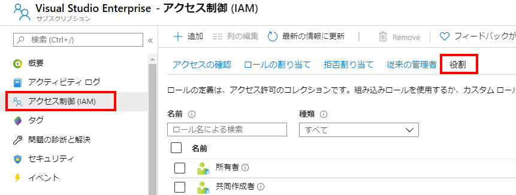

---
wts:
    title: '14 - RBAC を使用したアクセスの管理 (5 分)'
    module: 'モジュール 05: ID、ガバナンス、プライバシー、およびコンプライアンス機能に関する説明'
---
# 14 - RBAC を使用したアクセスの管理

このチュートリアルでは、ロールを割り当て、アクティビティ ログを表示します。 

# タスク 1: ロールの表示と割り当て (5 分)

このタスクでは、仮想マシンの共同作成者ロールを割り当てます。 

1. [Azure portal](https://portal.azure.com) にサインインします。

2. **「すべてのサービス」** ブレードで、**「リソース グループ」** を検索して選択し、**「+ 追加」** をクリックします。

3. 新しいリソース グループを作成します。完了したら、「**作成**」 をクリックします。 

    | 設定 | 値 |
    | -- | -- |
    | サブスクリプション | **サブスクリプションを選択する** |
    | リソース グループ | **myRGRBAC** |
    | リージョン | **(米国) 米国東部** |
    | | |

4. 「**確認および作成**」 を選択し、「**作成**」 をクリックします。

5. リソース グループ ページを **「最新の情報に更新」** して、新しく作成したリソース グループを表すエントリをクリックします。

6. **「アクセスの制御 (IAM)」** ブレードをクリックして、**「ロール」** タブに切り替えます。使用可能な多数のロール定義をスクロールします。情報アイコンを使用して、各ロールの権限を把握します。各ロールに割り当てられているユーザーとグループの数に関する情報もあります。

    

7. **「myRGRBAC - アクセスの制御 (IAM)」** ブレードの **「ロールの割り当て」** タブに切り替え、**「+ 追加」** をクリックして **「ロールの割り当ての追加」** をクリックします。自分のユーザー アカウントに仮想マシン共同作成者のロールを割り当てて、**「保存」** をクリックします。 

    | 設定 | 値 |
    | -- | -- |
    | ロール | **仮想マシンのコントリビューター** |
    | アクセスの割り当て | **ユーザー、グループ、サービス プリンシパル** |
    | 選択 | 自分のユーザー アカウント |
    | | |

    **注:** 仮想マシン共同作成者のロールでは仮想マシンを管理できますが、そのオペレーティング システムにアクセスしたり、接続先の仮想ネットワークやストレージ アカウントを管理したりすることはできません。

    

8. 「ロールの割り当て」 ページを**更新**し、仮想マシンの共同作成者として表示されていることを確認します。 

    **注**: 共同制作者ロールに関連する権限すべてを有する所有者のロールをアカウントがすでに有しているため、この割り当てにより付加的な権限が付与される訳ではありません。

# タスク 2: ロールの割り当てを確認し、ロールを削除する

このタスクでは、アクティビティ ログを表示してロールの割り当てを確認し、ロールを削除します。 

1. 「myRGRBAC リソース グループ」 ブレードで、**「アクティビティ ログ」** をクリックします。

2. 「**フィルターの追加**」 をクリックして 「**操作**」 を選択し、「**ロールの割り当てを作成**」 をクリックします。

    

3. アクティビティ ログにロールの割り当てが表示されていることを確認します。 

    **注**: ロールの割り当てを削除する方法は分かりますか。

成功しました。ロールを割り当て、アクティビティ ログを表示しました。 

**注**: 追加コストを回避するには、このリソース グループを削除します。リソース グループを検索し、リソース グループをクリックして、**「リソース グループの削除」** をクリックします。リソース グループの名前を確認し、**「削除」** をクリックします。**通知**を監視して、削除の進行状況を確認します。

