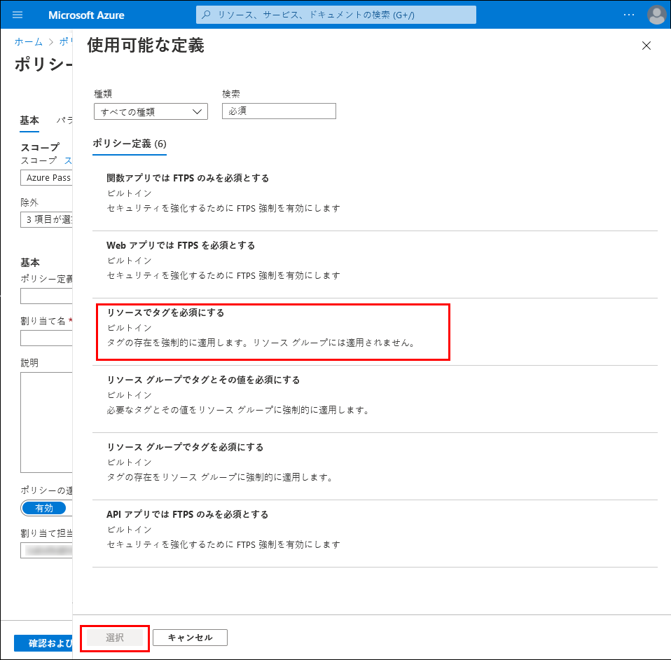
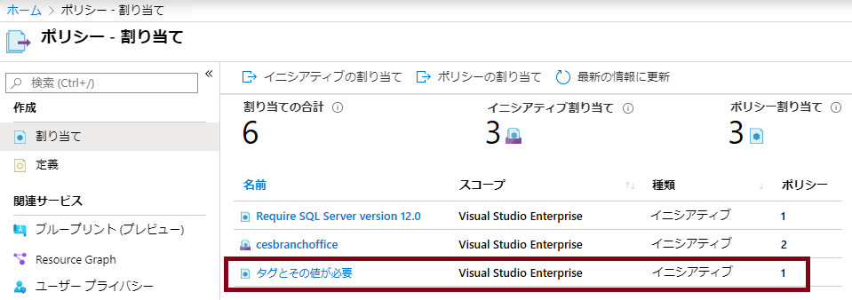

---
wts:
    title: '17 - リソースのタグ付けを実装する'
    module: 'モジュール 03 - セキュリティ、プライバシー、コンプライアンス、および信頼性'
---
# 17 - リソースのタグ付けを実装する

このチュートリアルでは、タグ付けが必要なポリシー割り当てを作成し、ストレージ　アカウントを作成してタグ付けをテストし、指定されたタグを持つリソースを表示し、タグ付けポリシーを削除します。

推定時間: 30 分

# タスク 1: ポリシー割り当てを作成する

このタスクでは、「**指定されたタグを必要とする**」 ポリシーを構成し、サブスクリプションに割り当てます。 

1. [Azure Portal](https://portal.azure.com) にサインインします。

2. 「**ポリシー**」 を検索して選択します。 

3. 「**作成**」 セクションで 「**割り当て**」 をクリックし、ページの上部から 「**ポリシーの割り当て**」 を選択します。

4. ポリシーの **範囲** はサブスクリプション全体になります。 

5. 「**ポリシー定義**の省略記号」 ボタン (右側のテキスト ボックスの末尾) を選択します。「**検索**」 ボックスに **タグ** を入力し、「**指定されたタグを必要とする**」 の定義をクリックして、「**選択**」 をクリックします。

   

6.  「**ポリシーの割り当て**」 ウィンドウの 「**パラメーター**」 タブで、タグ名に 「**Company**」 と入力します。「**確認および作成**」 をクリックし、「**作成**」 をクリックします。

    **注記:** これは、タグ付けを示す簡単な例です。 

    

7. 「**指定されたタグを必要とする**」 ポリシーの割り当てが設定されました。  サブスクリプション リソースを作成するときは、Company タグ値を指定する必要があります。

   

# タスク 2: ストレージアカウントを作成して、必要なタグ付けをテストする

このタスクでは、ストレージ アカウントを作成して、必要なタグ付けをテストします。 

1. Azure Portal で 「**ストレージ アカウント**」 を検索して選択し、「**+ 追加**」 をクリックします。   

2. ストレージ アカウントを構成します。 

    | 設定 | 値 | 
    | --- | --- |
    | サブスクリプション | **サブスクリプションを使用する** |
    | リソース グループ | **myRGTags** (新規) |
    | ストレージ アカウント名 | **storageaccountxxx** (一意である必要があります) |
    | 場所 | **(US) 米国東部** |
    | | |

3. 「**確認および作成**」 をクリックします。 

**注記:** タグが提供されない場合に何が起こるかをテストします。 

4. 検証に失敗したメッセージが表示され、「**ここをクリックして詳細を表示する**」 メッセージをクリックします。結果の **エラー** ブレードの 「**概要**」 タブで、**ポリシーによってリソースが許可されていません** というエラーメッセージに注意してください。

    **注記:** 「未加工のエラー」 タブを表示すると、必要な特定のタグ名が表示されます。 

    

5. 「**エラー**」 ペインを閉じ、「**前へ**」 （画面の下部）をクリックします。タグ付け情報を入力します。 

    | 設定 | 値 | 
    | --- | --- |
    | タグ名 | **Company** (ドロップダウン リストにない可能性があります) |
    | タグ値 | **Contoso** |
    | | |

6. 「**確認および作成**」 をクリックすると、検証に合格します。「**作成**」 をクリックしてストレージ アカウントを展開します。  

# タスク 3: 特定のタグを持つすべてのリソースを表示します

1. ポータルで 「**タグ**」 を検索して選択します。

2. 使用可能なすべてのタグ/値が表示されることに注意してください。**Company:Contoso** ペアを選択すると、ストレージ アカウントが一覧表示されます。タグを表示するには、ストレージ アカウントを展開する必要があります。 

   

3. ポータルで、「**すべてのリソース**」 を検索して選択します。

4. 「**フィルターの追加**」 をクリックし、**Company** タグを追加します。検索をタグの使用可能な値に制限できることに注意してください。フィルターが適用されると、ストレージ アカウントが一覧表示されます。

    

# タスク 4: ポリシーの割り当てを削除する

このタスクでは、 **指定されたタグを必要とする** ポリシーを削除して、今後の作業に影響を与えないようにします。 

1. ポータルで 「**ポリシー」 を検索 **して選択し、「**指定されたタグを必要とする**」 ポリシーをクリックします。 

2. トップメニューから 「**割り当ての削除**」 を選択します。

3. 「**はい**」 をクリックして、「**割り当ての削除**」 ダイアログでポリシー割り当てを削除することを確認します。

4. 時間があれば、別のリソースを作成して、ポリシーが無効になっていることを確認してください。

タグ付けが必要なポリシー割り当てを作成し、ストレージ　アカウントを作成してタグ付けをテストし、指定されたタグを持つリソースを表示し、タグ付けポリシーを削除しました。

**注記**: 追加コストを回避するには、このリソース グループを削除します。リソース グループを検索し、リソース グループをクリックして、「**リソース グループの削除**」 をクリックします。リソース グループの名前を確認し、「**削除**」 をクリックします。**通知** を監視して、削除の進行状況を確認します。